# arbol-bst-empresa-cpp
## Integrantes: 
Morocho Buñay Sandra Paola 
## Objetivo 
Implementar un Árbol Binario de Búsqueda (BST) en C++ para organizar empleados dentro de una empresa utilizando un código numérico como clave, permitiendo realizar operaciones eficientes de inserción, búsqueda y recorrido.
## Funcionalidades:
- Insertar empleados
- Buscar empleados
- Mostrar raíz
- Recorridos inorden, preorden y postorden
- Calcular altura
- Mostrar nodos hoja
## Capturas:
1. Menú principal

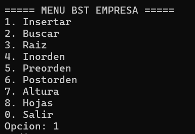

2. Inserción de empleados

Los datos a ingresar son: 

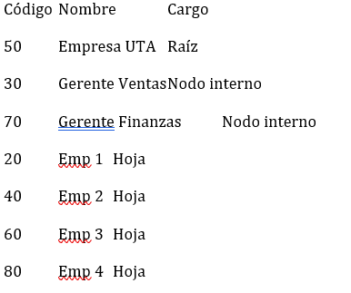

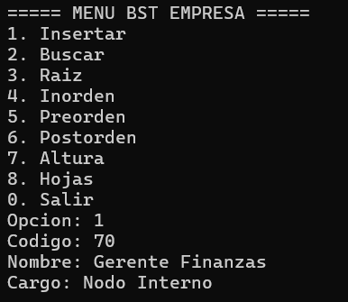

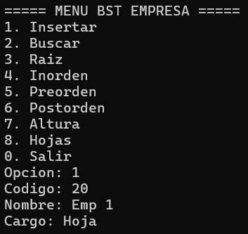

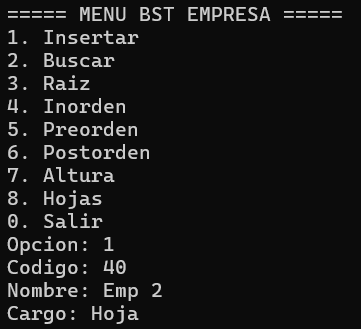

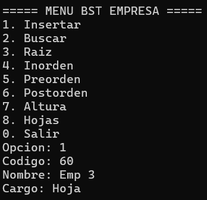

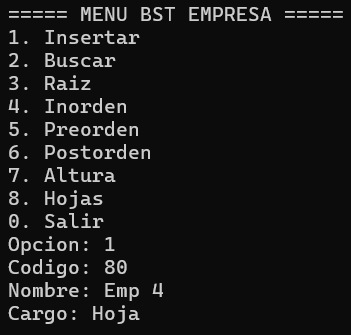

3. Raiz 

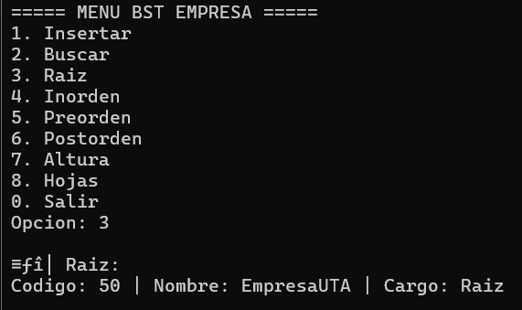

4. Búsqueda

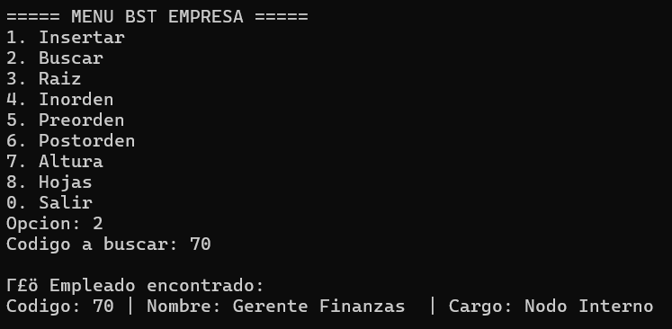

5. Recorridos

- Inorden 

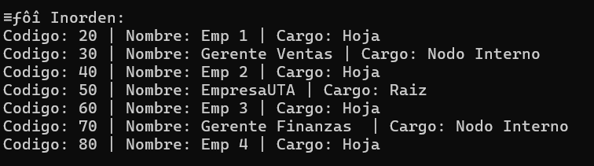

- Preorden

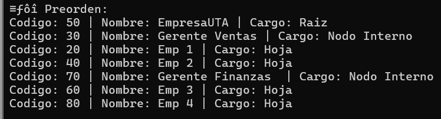

- Postorden

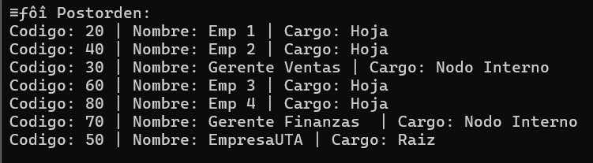

6. Altura y hojas

- Altura

 

- Hojas

## Explicacion 
- Raiz

Es el primer nodo del árbol, desde donde se origina toda la estructura, en nuestro caso es la EmpresaUTA

- Nodo Interno 

Nodo que tiene al menos un hijo, son los gerentes ingresados 

- Hoja 

Nodo que no tiene hijos, son los empleados que ingresamos 

- Nivel 

Indica la posición de un nodo en el árbol:

Nivel 1 → Raíz

Nivel 2 → Hijos de la raíz

Nivel 3 → Nietos, etc.

En nuestro caso tenemos 3 niveles: 

Nivel 1 → EmpresaUTA

Nivel 2 → Gerentes

Nivel 3 → Empleados

- Altura

Es la longitud del camino más largo desde la raíz hasta una hoja.
Representa cuántos niveles tiene el árbol. 

## Ejemplo de funcionamiento 
Al insertar los datos sugeridos, el árbol se organiza automáticamente:
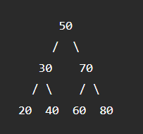

## Conclusión
* El Árbol Binario de Búsqueda permite organizar datos de forma jerárquica y eficiente, facilitando búsquedas rápidas y recorridos ordenados.

* Es una estructura fundamental en informática y muy utilizada en sistemas reales como bases de datos y sistemas de archivos.
