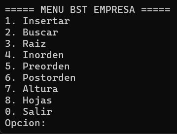
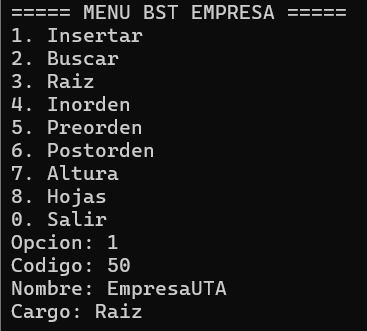
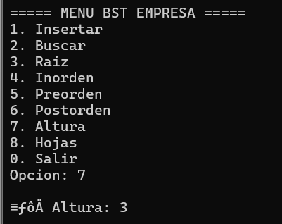
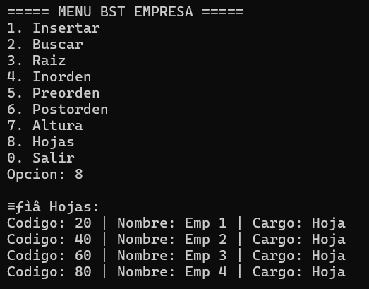

# arbol-bst-empresa-cpp
## Integrantes: 
Morocho Buñay Sandra Paola 
## Objetivo 
Implementar un árbol binario de búsqueda en C++ para organizar empleados de una empresa.
## Funcionalidades:
- Insertar empleados
- Buscar empleados
- Mostrar raíz
- Recorridos inorden, preorden y postorden
- Calcular altura
- Mostrar nodos hoja
## Capturas:
1. Menú principal

2. Inserción de empleados

3. Búsqueda

4. Recorridos

- Inorden 

- Preorden

- Postorden

5. Altura y hojas

- Altura

 

- Hojas

## Conclusión
El árbol permite organizar información jerárquica y realizar búsquedas eficientes.
